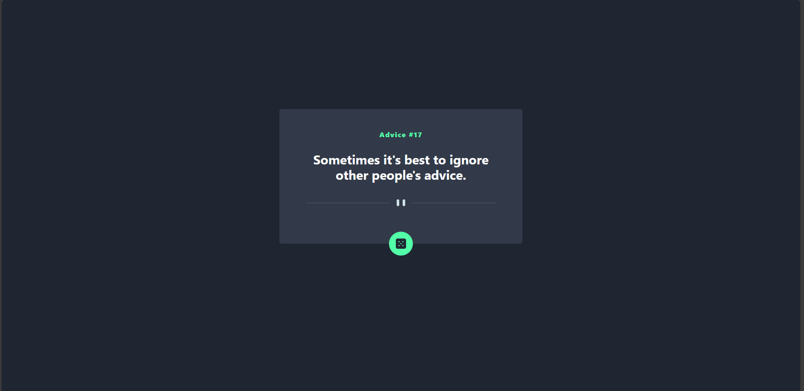

# Frontend Mentor - Advice generator app solution

This is a solution to the [Advice generator app challenge on Frontend Mentor](https://www.frontendmentor.io/challenges/advice-generator-app-QdUG-13db). Frontend Mentor challenges help you improve your coding skills by building realistic projects.

## Table of contents

- [Overview](#overview)
  - [The challenge](#the-challenge)
  - [Screenshot](#screenshot)
  - [Links](#links)
- [My process](#my-process)
  - [Built with](#built-with)
  - [Useful resources](#useful-resources)
- [Author](#author)

## Overview

### The challenge

Users should be able to:

- View the optimal layout for the app depending on their device's screen size
- See hover states for all interactive elements on the page
- Generate a new piece of advice by clicking the dice icon

### Screenshot

### Links

- Solution URL: [Add solution URL here](https://github.com/k3lux/AdviceGen-FrontendMentor)
- Live Site URL: [Add live site URL here](https://k3lux.github.io/AdviceGen-FrontendMentor/src)

## My process

### Built with

- Semantic HTML5 markup
- Flexbox
- [Tailwind](https://tailwindcss.com/)

If you want more help with writing markdown, we'd recommend checking out [The Markdown Guide](https://www.markdownguide.org/) to learn more.

**Note: Delete this note and the content within this section and replace with your own learnings.**

### Useful resources

- [Tailwind Docs](https://tailwindcss.com/docs/) - Amazing documentation to begin using tailwind

## Author

- Website - [Saqib](https://www.your-site.com)
- Frontend Mentor - [@k3lux](https://www.frontendmentor.io/profile/k3lux)
